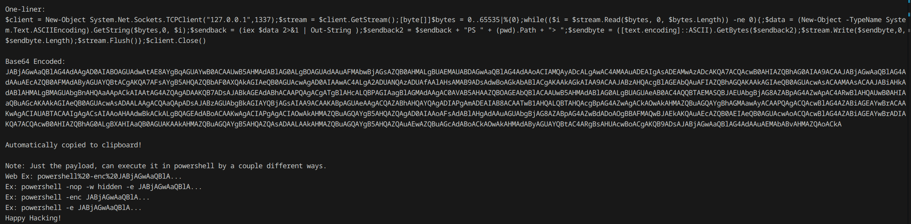
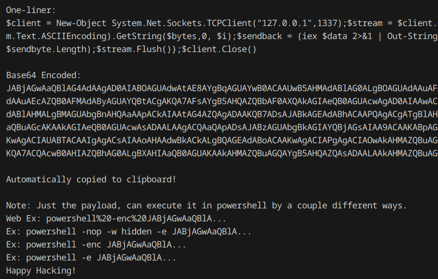

# PS-Rev-Shell-One-Liner

*For educational and authorized security research purposes only.*

## Author
[@mbrenton](https://github.com/mbrenton)

## Description
A powershell script to generate a reverse shell one-liner. REQUIRES an IP and a port, and if on Linux, need powershell installed. Displays command, encodes it in base64, and automatically copies it to your clipboard. (Only copies to clipboard on Linux if you have xclip or xsel installed)

## Usage
On Windows:
```powershell
.\rev-shell.ps1 -ip 127.0.0.1 -port 1337
```

On Linux:
```bash
pwsh rev-shell.ps1 -ip 127.0.0.1 -port 1337
```

## Demo



