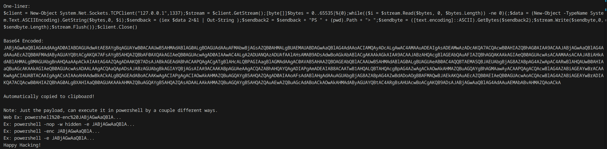
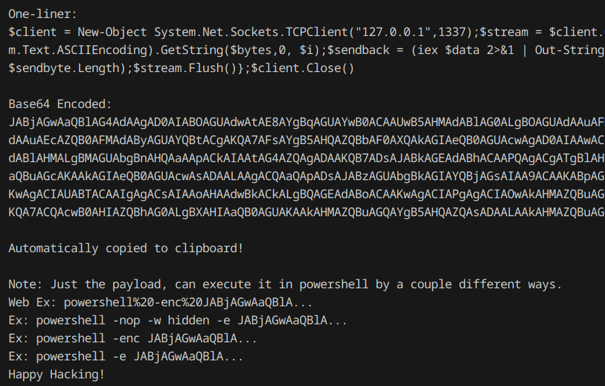

# PS-Rev-Shell-One-Liner

A powershell script to generate a reverse shell one-liner.<br>
REQUIRES an IP and a port, and if on Linux, need powershell installed.<br>
Displays command, encodes it in base64, and automatically copies it to your clipboard.<br>
(Only copies to clipboard on Linux if you have xclip or xsel installed)<br>

On Windows:
```
.\rev-shell.ps1 -ip 127.0.0.1 -port 1337
```

On Linux:
```
pwsh rev-shell.ps1 -ip 127.0.0.1 -port 1337
```

Ex:



